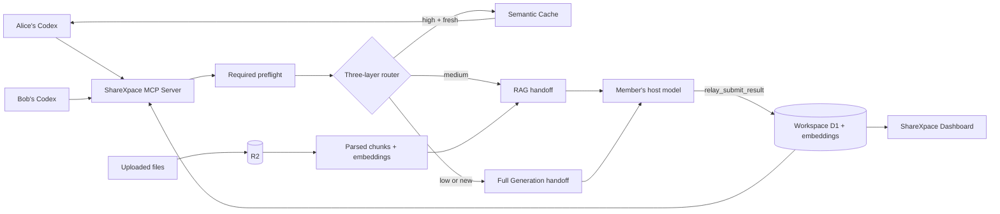

# ShareXpace Demo Guide

ShareXpace is a shared AI workspace for Codex, ChatGPT, IDE agents, and other MCP clients. Each member continues using their own host agent and model while ShareXpace provides shared chat, shared knowledge, document retrieval, duplicate-work detection, and workspace-level token analytics.

The recommended hackathon demo uses one `RoamTogether` Workspace and two Codex members who are building a travel-planning product together:

- Alice is the frontend developer.
- Bob is the backend developer.
- Both connect to the same ShareXpace MCP server.
- Both use the same Workspace ID.
- Their Codex host models perform RAG and Full Generation.
- ShareXpace returns fresh cached answers without another generation call.

| Demo surface | Best for | Setup | Suggested duration |
| --- | --- | --- | --- |
| **Codex App** | Judges, video demos, nontechnical viewers | Install the ShareXpace plugin | 3 minutes |
| **Codex CLI** | Engineering validation and a two-person live demo | Plugin or one-click installer | 5–10 minutes |

Both versions use the same hosted MCP server, D1 data, R2 files, embeddings, routing rules, and Dashboard.

## 1. What the demo proves

The demo shows that:

- One MCP connection can access multiple isolated Workspaces.
- Agents can create a Workspace with `relay_create_workspace` and immediately use it without adding another MCP server.
- Every Workspace has independent shared knowledge, embedding vectors, Semantic Cache, chat, route history, token analytics, and connected-agent activity.
- Every workspace task begins with `relay_preflight`.
- A fresh high-similarity match uses **Semantic Cache** and avoids a main-model generation call.
- A medium-similarity match uses **RAG**, returning relevant team knowledge to the member's host agent.
- A low-similarity or new request uses **Full Generation**, returning the valid Workspace context to the member's host agent.
- The host agent saves RAG and Full Generation results with `relay_submit_result`.
- Uploaded files are stored in R2, parsed, chunked, embedded, and included in Workspace RAG.
- Shared Chat lets members and agents report progress without copying results between tools manually.
- The Dashboard exposes route counts, embedding requests, estimated usage, estimated tokens saved, provider-cached tokens, errors, recent agents, and per-record knowledge usage.

The hosted endpoints used by this guide are:

```text
Dashboard: https://relay-production-2026.opompm841218.chatgpt.site
MCP:       https://relay-production-2026.opompm841218.chatgpt.site/api/mcp
Workspace: RoamTogether
```

The public URL still contains the original deployment slug. The product name, plugin name, and repository name are **ShareXpace**.

## 2. Architecture at a glance



ShareXpace does not call the generation model for MCP RAG or Full Generation routes. It decides the route, supplies safe context, records the lifecycle, and waits for the connected host agent to submit its result.

## 3. Fastest setup: install the ShareXpace plugin

Use this option for the Codex App demo.

1. Install and sign in to the Codex App.
2. Clone or download the ShareXpace repository.
3. Open the repository root in Codex.
4. Fully quit and reopen Codex so it discovers `.agents/plugins/marketplace.json`.
5. Open **Codex → Plugins**.
6. Select **ShareXpace**, then choose **Install**.
7. Start a new Codex task. Tasks opened before installation do not automatically load the new skill or MCP tools.
8. Enter:

   ```text
   Set up ShareXpace and show the available workspaces.
   ```

9. When Codex asks what name to use in ShareXpace, enter a display name such as `Alice`.

The selected name is passed as `memberName` to every ShareXpace tool. It appears in recent-agent activity and audit records. It is a display identity for this demo, not an authentication credential.

No Workspace member token, OpenAI API key, Gemini key, Cloudflare credential, or second MCP connection is required for plugin users.

## 4. Codex App demo

### 4.1 Verify the connection

Start a new task and enter:

```text
Set up ShareXpace. Use the name Alice.
List the available workspaces, select workspaceId "RoamTogether",
and report its Workspace name, ID, UI URL, embedding provider,
Semantic Cache count, RAG count, Full Generation count,
and estimated tokens saved.
```

Expected tools:

```text
relay_list_workspaces
relay_get_workspace
```

Expected output includes:

```text
Workspace name: RoamTogether
Workspace ID: RoamTogether
Workspace UI: https://relay-production-2026.opompm841218.chatgpt.site/RoamTogether
```

Open the Workspace URL in a browser and sign in with ChatGPT if requested.

### 4.2 Test Shared Chat

Enter:

```text
Use ShareXpace to post this discussion to workspaceId "RoamTogether":
"Alice connected from Codex App and is ready to start frontend work."
Do not rewrite the message and do not generate an answer.
```

Expected tool:

```text
relay_post_update
```

The message should appear in Shared Chat. Alice should appear under **Connected Agents** for five minutes after her latest successful or failed Workspace tool activity. The Dashboard refreshes this view automatically.

### 4.3 Create another Workspace

This feature is optional during the main demo, but it proves that one MCP server supports many isolated Workspaces.

```text
Use ShareXpace to create a Workspace named ProductLaunch
with workspaceId "ProductLaunch".
Return only the Workspace name, ID, and UI URL.
```

Expected tool:

```text
relay_create_workspace
```

Expected URL:

```text
https://relay-production-2026.opompm841218.chatgpt.site/ProductLaunch
```

Continue using the same MCP connection. Pass `workspaceId: "ProductLaunch"` to later Workspace tools.

### 4.4 Run the routing demo

Run Scenes 1–3 in Section 7. After each scene, switch to the Dashboard and show:

- The route counter changed.
- The result appeared in Shared Knowledge when RAG or Full Generation completed.
- A Semantic Cache reuse did not create a duplicate Shared Knowledge record.
- Per-record **Searched**, **Cache hits**, **RAG reuses**, and **Last hit** values changed as expected.

## 5. Codex CLI demo

### 5.1 Install Codex CLI

On macOS or Linux, open Terminal and run the official installer:

```bash
curl -fsSL https://chatgpt.com/codex/install.sh | sh
```

Close and reopen Terminal, then verify the installation:

```bash
codex --version
```

Start Codex once and select **Sign in with ChatGPT**:

```bash
codex
```

Exit with `/exit` or `Ctrl+C` before continuing with manual MCP setup.

### 5.2 One-click CLI setup

From the ShareXpace repository root, double-click:

```text
INSTALL_RELAY_DEMO.command
```

Or run:

```bash
./INSTALL_RELAY_DEMO.command
```

The installer:

1. Installs or updates Codex CLI.
2. Verifies `codex --version`.
3. Asks for a member display name.
4. Registers the hosted ShareXpace MCP server as `relay`.
5. Verifies the saved configuration.
6. Performs an MCP `initialize` handshake and requires HTTP 200.
7. Starts Codex unless `--no-launch` is used.

To configure without launching:

```bash
./scripts/install-relay-demo.sh --no-launch
```

The installer does not use `RELAY_MCP_TOKEN` and does not request a model API key.

### 5.3 Manual CLI setup

Register the MCP server once. The URL-level `member` value is only a fallback label; the plugin workflow also asks for and sends `memberName` with every tool call.

```bash
codex mcp add relay \
  --url "https://relay-production-2026.opompm841218.chatgpt.site/api/mcp?member=Alice"
```

Verify it:

```bash
codex mcp get relay --json
codex mcp list
```

Equivalent configuration:

```toml
[mcp_servers.relay]
url = "https://relay-production-2026.opompm841218.chatgpt.site/api/mcp?member=Alice"
```

Restart Codex and open a new task after changing MCP configuration.

### 5.4 Verify Workspace access

In Codex CLI, enter:

```text
Use the name Alice in ShareXpace.
Call relay_list_workspaces, then use workspaceId "RoamTogether"
with relay_get_workspace. Report the Workspace name, ID,
embedding provider, and all three route counts.
```

Then test chat:

```text
Use ShareXpace to post this exact discussion to workspaceId "RoamTogether":
"Alice connected from Codex CLI and is ready to start frontend work."
Do not rewrite the message.
```

### 5.5 Two-person CLI setup

For the clearest live demo, use two computers or two independent Codex sessions:

| Member | Display name | Role |
| --- | --- | --- |
| Alice | `Alice` | Frontend developer and first Full Generation request |
| Bob | `Bob` | Backend developer and RAG/Semantic Cache follow-up |

Both members connect to the same MCP endpoint and use `workspaceId: "RoamTogether"`. They do not need the same Codex account or the same host model.

To remove the manual MCP configuration after the demo:

```bash
codex mcp remove relay
```

## 6. Prepare a clean demo Workspace

Use one Workspace for the main presentation. `RoamTogether` is recommended.

Before recording:

1. Open the `RoamTogether` Dashboard.
2. In Shared Knowledge, select **Reset knowledge**.
3. Enter the displayed Workspace ID exactly.
4. Enter `RESET SHARED KNOWLEDGE`.
5. Confirm deletion.

This clears generated knowledge, record and document embeddings, Semantic Cache entries, uploaded files, and pending preflights for that Workspace. Shared Chat and historical analytics remain available.

Optionally upload frontend requirements, API requirements, a product brief, or travel data before the demo. ShareXpace stores the original bytes in R2 and indexes parsed chunks for RAG.

## 7. Three-layer routing demo

### Scene 1: Full Generation

Alice enters:

```text
Create a five-day Tokyo itinerary for our team. Prioritize walkable neighborhoods, one day trip, and a moderate budget.
```

Expected flow:

1. Codex calls `relay_preflight` with `operation: "auto"`.
2. ShareXpace shows Hybrid, raw embedding, and normalized lexical similarity.
3. With no related Workspace memory, all three scores are `0%` and the route is `full_generation`.
4. Codex must not ask whether to use RAG or Full Generation when all scores are zero.
5. Codex calls `relay_execute` immediately.
6. ShareXpace returns `agent_action_required` with the valid Workspace context and `requiredNextTool: "relay_submit_result"`.
7. Alice's Codex host model creates the itinerary.
8. Codex calls `relay_submit_result` with the unchanged question and final answer.
9. The result appears in Shared Knowledge and Shared Chat.

### Scene 2: RAG

Bob enters:

```text
Adapt our five-day Tokyo plan for one rainy day and vegetarian dining while preserving the moderate budget.
```

Expected flow:

1. Codex calls `relay_preflight`.
2. ShareXpace finds a nonzero related match and displays all similarity scores.
3. Codex asks the member to choose RAG or Full Generation, ends the turn, and waits.
4. The member replies `RAG`.
5. Codex calls `relay_confirm_route` with `selectedRoute: "rag"` and `confirmedByUser: true`.
6. Codex passes the new executable preflight ID to `relay_execute`.
7. ShareXpace returns only fresh, relevant team knowledge and document chunks.
8. Bob's Codex host model creates the adapted answer.
9. Codex calls `relay_submit_result`.
10. The Dashboard increments the RAG counter and the source record's RAG reuse count.

### Scene 3: Semantic Cache

Enter either the original question or this close paraphrase:

```text
Create a 5-day Tokyo itinerary for us. Prioritize walkable neighborhoods, 1 day trip, and an affordable budget.
```

Expected flow:

1. Codex calls `relay_preflight` with `operation: "auto"`.
2. A fresh exact or high-confidence match selects `semantic_cache`.
3. Main-model input and output usage are zero.
4. Codex calls `relay_execute`.
5. ShareXpace returns and displays the complete cached answer.
6. Codex asks whether the member accepts the answer or wants a RAG update, then ends the turn.
7. If the member accepts it, Codex calls no additional tool.
8. If the member asks for an update in a later turn, Codex calls `relay_rag_refresh_preflight` with `confirmedByUser: true`.

Semantic Cache eligibility requires fresh data and direct reuse permission. A match may qualify through the configured Hybrid threshold, raw embedding threshold, or conservative normalized lexical threshold. Expired, superseded, refresh-required, and transactional records cannot be returned directly.

### Scene 4: report progress to Shared Chat

Either member enters:

```text
Post this exact update to the RoamTogether Shared Chat:
"The Tokyo itinerary, rainy-day alternative, and vegetarian options are ready for team review."
```

Expected tool:

```text
relay_post_update
```

### Scene 5: Dashboard summary

Show:

- Semantic Cache, RAG, and Full Generation counts.
- Embedding request count and provider status.
- Estimated tokens used and estimated tokens saved.
- Provider-reported cached input tokens, when available.
- Errors and recent MCP activity.
- Alice and Bob under Connected Agents if active in the last five minutes.
- Shared Knowledge records created by RAG and Full Generation.
- Per-record searched time, Cache hits, RAG reuses, and last-hit time.

## 8. Route-preview rules

For every Workspace prompt, `relay_preflight` displays:

```text
Hybrid similarity: ...%
Raw embedding similarity: ...%
Normalized lexical similarity: ...%
Embedding provider: ...
Recommended route: Semantic Cache / RAG / Full Generation
```

The host must follow these rules:

- **Semantic Cache:** call `relay_execute`, display the cached answer, ask `Accept` or `RAG update`, and wait.
- **All three scores are zero:** automatically call `relay_execute` for Full Generation. Do not ask the member to choose a route.
- **A nonzero related match exists:** ask the member to choose RAG or Full Generation, end the turn, and wait. After the reply, call `relay_confirm_route`.
- **RAG or Full Generation handoff:** use the host model, then call `relay_submit_result`.
- **Refresh:** never bypass routing, freshness checks, or the submission lifecycle.

If the embedding provider fails, the preview identifies lexical fallback. A raw embedding score of `0%` in that state means no provider score was obtained; it does not claim that two questions are semantically unrelated.

## 9. MCP smoke tests

These examples are for transport debugging. Plugin and Codex users normally do not need them.

### Initialize

```bash
curl "https://relay-production-2026.opompm841218.chatgpt.site/api/mcp?member=Alice" \
  -H "Content-Type: application/json" \
  -d '{"jsonrpc":"2.0","id":1,"method":"initialize","params":{"protocolVersion":"2025-06-18","capabilities":{},"clientInfo":{"name":"alice-codex","version":"1.0"}}}'
```

### List tools

```bash
curl "https://relay-production-2026.opompm841218.chatgpt.site/api/mcp?member=Alice" \
  -H "Content-Type: application/json" \
  -d '{"jsonrpc":"2.0","id":2,"method":"tools/list","params":{}}'
```

### Create a Workspace

```bash
curl "https://relay-production-2026.opompm841218.chatgpt.site/api/mcp?member=Alice" \
  -H "Content-Type: application/json" \
  -d '{"jsonrpc":"2.0","id":3,"method":"tools/call","params":{"name":"relay_create_workspace","arguments":{"memberName":"Alice","name":"ProductLaunch","workspaceId":"ProductLaunch"}}}'
```

### Run a preflight

```bash
curl "https://relay-production-2026.opompm841218.chatgpt.site/api/mcp?member=Alice" \
  -H "Content-Type: application/json" \
  -d '{"jsonrpc":"2.0","id":4,"method":"tools/call","params":{"name":"relay_preflight","arguments":{"memberName":"Alice","workspaceId":"RoamTogether","question":"Create a five-day Tokyo itinerary for our team. Prioritize walkable neighborhoods, one day trip, and a moderate budget.","operation":"auto"}}}'
```

Preflight IDs expire, are bound to the member and exact question, and are single-use.

## 10. Troubleshooting

### The ShareXpace plugin is not visible

- Confirm Codex opened the repository root containing `.agents/plugins/marketplace.json`.
- Fully quit and reopen Codex.
- Search for `ShareXpace`, not the MCP server's deployment slug.

### The plugin is installed but Relay tools are missing

- Update or reinstall the plugin.
- Fully restart Codex.
- Start a new task instead of reusing a task opened before installation.

### Codex did not use the selected member name

- Start a new task so the current required `memberName` schema is loaded.
- Answer the ShareXpace setup question before the first Relay tool call.
- Confirm the same name is passed to every later Relay tool.

### `workspace_id_required` or `workspace_not_found`

Call `relay_list_workspaces`, copy the exact ID, and pass it as `workspaceId`. Creating or changing a Workspace does not require editing the MCP URL.

### MCP startup returns HTTP 401 with a sign-in HTML page

The MCP transport was intercepted by browser authentication. Confirm the URL points to the current hosted `/api/mcp` endpoint, remove the old `relay` configuration, rerun the installer, restart Codex, and open a new task.

### Opening `/api/mcp` in a browser looks blank or returns an error

This is expected. `/api/mcp` accepts MCP JSON-RPC requests; it is not a human-facing page. Open the Dashboard root or a Workspace URL instead.

### Do members need `OPENAI_API_KEY`?

No. Regular members use their Codex host model for RAG and Full Generation. ShareXpace manages its own server-side embedding provider. Provider keys must never be distributed to Workspace members.

### `database_not_ready`

Apply every SQL migration in `drizzle/` to the configured D1 database.

### `estimate_expired` or `estimate_prompt_changed`

Run `relay_preflight` again and keep the question text unchanged through `relay_execute` and `relay_submit_result`.

### RAG became Full Generation

The related result may be below the RAG threshold or no longer fresh. Use a question that clearly extends a saved answer, inspect all three scores, and select RAG only after ShareXpace reports a nonzero related match.

### Semantic Cache did not match

Check that the record:

- Has not expired.
- Is not marked `requiresRefresh`.
- Has not been superseded.
- Allows direct reuse.
- Is not transactional knowledge.

Also verify that the embedding provider did not fall back and that at least one configured high-confidence threshold was reached.

## 11. Demo checklist

- [ ] Choose either the Codex App or CLI setup for the presentation.
- [ ] Ask each member for a ShareXpace display name during setup.
- [ ] Connect both roles to `workspaceId: "RoamTogether"`.
- [ ] Confirm the Dashboard shows the correct Workspace name and ID.
- [ ] Reset Shared Knowledge before recording if a clean route sequence is required.
- [ ] Scene 1 selects Full Generation and completes `relay_submit_result`.
- [ ] Scene 2 selects RAG after explicit member confirmation.
- [ ] Scene 3 selects Semantic Cache and reports no main-model generation.
- [ ] The cached answer is displayed before asking `Accept` or `RAG update`.
- [ ] Shared Chat receives a progress message.
- [ ] Alice and Bob appear as recently active agents.
- [ ] All three route counters are visible.
- [ ] Actual cached input tokens and estimated tokens saved are shown separately.
- [ ] Shared Knowledge shows per-record search and hit statistics.

## 12. Key implementation files

- `README.md` — product architecture, deployment, configuration, and safeguards.
- `DEMO_GUIDE.md` — this end-to-end App and CLI demo runbook.
- `plugins/sharexpace/README.md` — plugin installation, update, removal, and sharing instructions.
- `plugins/sharexpace/skills/sharexpace-workspace/SKILL.md` — required host-agent workflow.
- `app/api/mcp/route.ts` — MCP tools, resources, and JSON-RPC transport.
- `app/api/_lib/relay-service.ts` — shared MCP/Web orchestration.
- `app/api/_lib/workspace.ts` — D1 access, retrieval, freshness, estimates, presence, and analytics.
- `app/api/_lib/model.ts` — Web generation path and prompt/token handling.
- `app/workspace-dashboard.tsx` — Workspace Dashboard UI.
- `scripts/install-relay-demo.sh` — one-click CLI setup.
