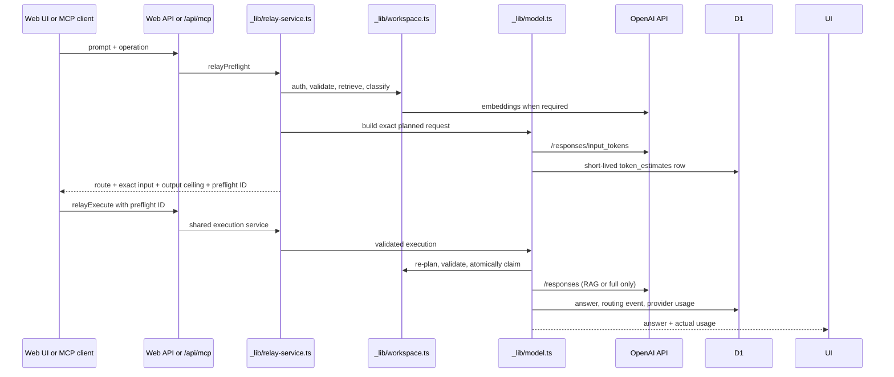

# Relay Production — Development Handoff

## Repository split

| Directory | Purpose | Data policy |
| --- | --- | --- |
| `../team-memory` | Hackathon demo | Seeded scenarios and demo-friendly behavior |
| `./` (`team-memory-production`) | Production edition | Empty workspace, migrated schema, authenticated users, real provider responses |

Never point both editions at the same D1 database or Sites `project_id`. Production does not import demo records at runtime.

## Request flow and owning files

### UI

- `app/page.tsx`: workspace state, shared chat, Ask flow, two-click estimate/confirm interaction, actual-usage cards, master/BYOK selection.
- `app/globals.css`: production UI styling, preflight, usage, and chat handoff states.
- `app/layout.tsx`: metadata and social card URL.

The UI invalidates an estimate whenever the prompt or billing selection changes. The API remains authoritative and rejects stale or mismatched estimates even if a client bypasses the UI.

### API routes

| Route | Responsibility |
| --- | --- |
| `api/state` | Authenticated workspace records, chat, statistics, model readiness |
| `api/questions/estimate` | Route selection and exact preflight token count |
| `api/questions/ask` | Estimated RAG/full-generation submission |
| `api/reuse` | Estimated Semantic Cache reuse with freshness guard |
| `api/knowledge/refresh` | Full refresh, new version creation, old version supersession |
| `api/chat` | Human discussion messages; never calls a model by itself |
| `api/chat/run` | Converts a shared message into an estimated agent task and posts the result back |
| `api/files` | Validated R2 upload plus D1 metadata/knowledge record |
| `api/questions/check` | Deprecated compatibility read; new clients use `estimate` |
| `/api/mcp` | Authenticated JSON-RPC MCP endpoint with tools and resources |

Every route uses `requireActor()` and `errorResponse()` from `workspace.ts`.

### MCP gateway

- `app/api/mcp/route.ts` owns MCP protocol handling, tool/resource descriptors, bearer authentication boundary, and tool-call audit events.
- `app/api/_lib/relay-service.ts` is the transport-neutral application layer shared by MCP and Web API routes.
- `relay_preflight` must precede `relay_execute`; direct execute attempts fail because no matching `token_estimates` authorization record exists.
- `RELAY_MCP_ACCESS_TOKENS` maps independent bearer tokens to member identities. Never reuse a single token for all members in production.
- MCP cannot prevent a third-party host from using its own model, but it guarantees every request spending the Relay Workspace Master key goes through the three-layer router.

### Shared domain layer

`app/api/_lib/workspace.ts` owns:

- Cloudflare bindings and environment parsing
- Sites identity extraction
- workspace/schema readiness checks
- TTL and direct-reuse policy
- lexical + embedding retrieval and three-layer classification
- query/record embedding persistence
- prompt estimate creation, validation, atomic claim, and final accounting
- workspace analytics

`app/api/_lib/model.ts` owns:

- stable-first prompt construction
- RAG versus full context selection
- exact `/v1/responses/input_tokens` preflight
- GPT-5.6 Responses calls
- explicit prompt-cache breakpoint/key
- provider usage parsing
- answer/version/audit persistence

Keep retrieval and lifecycle rules out of React components. Keep provider payload construction in `model.ts` so preflight and generation cannot drift.

`app/api/_lib/relay-service.ts` owns the end-to-end use cases (`relayPreflight`, `relayExecute`, `relayReuse`, refresh and search), so transports cannot bypass lifecycle policy by reimplementing database writes.

## Token accounting contract

`token_estimates` is an audit and authorization record, not only a UI cache.

- `estimated_input_tokens`: exact main-request input count returned by OpenAI; zero for Semantic Cache.
- `max_output_tokens`: configured ceiling, because future output cannot be known exactly.
- `retrieval_input_tokens`: embedding tokens used before routing.
- `claimed_at`: concurrency lock. Only one submission can claim an estimate.
- `actual_input_tokens`, `actual_output_tokens`, `actual_total_tokens`: Responses API usage.
- `actual_cached_tokens`: provider prompt-cache hit; not the same as semantic reuse savings.
- `actual_retrieval_input_tokens`: embedding usage accumulated across preflight/submission.
- `estimated_tokens_saved`: avoided generation estimate for Semantic Cache.

An estimate is rejected if its actor, prompt hash, route, operation, target record, expiry, claim, or consumed state does not match. If an upstream model request fails after claim, the user must estimate again; this prevents accidental duplicate provider calls.

## Three-layer router

1. Semantic Cache: high similarity plus fresh/direct-reuse eligibility. Returns stored answer and makes no main LLM call.
2. RAG: medium similarity or explicit “Generate with team knowledge.” Only matching valid summaries/sources enter dynamic context.
3. Full Generation + Prompt Caching: low similarity or refresh. All valid workspace context is used, with static/internal decisions first and the current question last.

The five knowledge types are `static`, `semi_dynamic`, `dynamic`, `transactional`, and `internal_decision`. Freshness uses `generated_at`, `expires_at`, `allow_direct_reuse`, `requires_refresh`, and `superseded_by`.

## Persistence

- `db/schema.ts`: Drizzle schema source of truth.
- `drizzle/0000...0004`: original MVP schema and lifecycle additions.
- `drizzle/0005_special_risque.sql`: token estimate audit table.
- `drizzle/0006_outgoing_terrax.sql`: atomic estimate claim column.
- `record_embeddings`: 256-dimension `text-embedding-3-small` vectors, including hashed preflight query embeddings to avoid repeating retrieval work on submit.
- `answer_cache`: exact normalized-question lookup.
- `routing_events`: route counts, provider cached tokens, and avoided-generation estimates.
- `model_calls`: provider prompt-cache audit.
- `mcp_events`: MCP member/client activity, tool success and selected route.
- `workspace_files` plus R2 `FILES`: uploaded object metadata and bytes.

Request handlers call `ensureWorkspace()` only to verify required tables and initialize the cache-version row. They never create schema or insert demo content.

## Security and operations

- Hosted identity comes from Sites-managed headers. Do not accept actor names from request JSON.
- Personal keys are request-scoped; never log or persist them.
- Use distinct D1/R2 resources and `RELAY_WORKSPACE_ID` per environment.
- Configure the workspace master key as a secret, not a plain repository variable.
- Apply migrations before deploying application code that expects them.
- Monitor 409 estimate errors, OpenAI 429/5xx rates, route distribution, and estimate-vs-actual deltas.
- Add rate limiting and organization membership/RBAC before opening a public multi-tenant deployment; the current Sites deployment is private and single-workspace.

## Safe change checklist

1. If provider payload fields change, update the shared plan/payload function so token counting and generation remain identical.
2. If route thresholds or freshness change, cover stale, transactional, and superseded cases.
3. If schema changes, run `pnpm db:generate` and inspect the SQL.
4. Run `pnpm lint`, `pnpm typecheck`, and `pnpm test`.
5. Apply migrations to a staging D1 database and smoke-test master and BYOK modes.
6. Deploy production separately; never overwrite the demo project ID.
