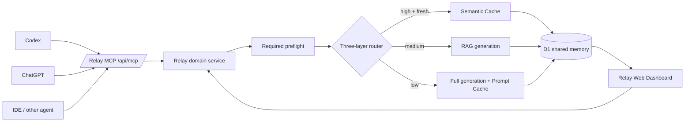
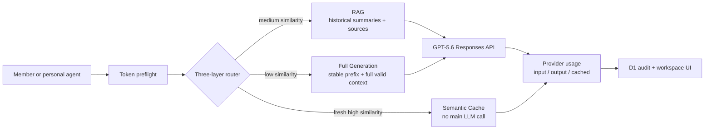

# Relay Production

Relay is a shared AI workspace and MCP gateway for teams and their personal agents. This directory is the production-oriented edition; the original seeded web demo remains unchanged in `../team-memory`.

The production edition deliberately has no demo seeds, fabricated model answers, anonymous hosted fallback, or shared demo database. It requires migrated D1 storage and authenticated requests. Web members may use the Workspace Master OpenAI API key or a request-scoped personal key. MCP clients always use the Workspace Master key, so the server can enforce and audit the shared three-layer route.

## Product architecture



The Web API and MCP server do not maintain separate routing implementations. Both call `app/api/_lib/relay-service.ts`, which makes `relay_preflight` mandatory before any Relay-funded `relay_execute` call. The preflight is identity-bound, prompt-bound, expiring and single-use.

## MCP server

The stateless Streamable HTTP-compatible endpoint is `https://<relay-host>/api/mcp`. It exposes:

- `relay_preflight` — semantic retrieval, TTL/version validation, route decision and input-token estimate.
- `relay_execute` — consumes the preflight and returns Semantic Cache, RAG or Full Generation output.
- `relay_search_memory` — read-only shared memory search.
- `relay_refresh_preflight` and `relay_refresh` — refresh a sourced record while preserving the old version.
- `relay_post_update` — return agent progress or results to the shared chat without an LLM call.
- `relay_get_workspace` — read route, savings, memory and MCP activity state.

Resources are available at `relay://workspace/<workspace-id>/{summary,memory,activity,savings}`. Configure a per-member bearer token in `RELAY_MCP_ACCESS_TOKENS`; the value is a JSON object mapping secret tokens to member names. MCP calls are recorded in `mcp_events`, and the Dashboard shows connected identities and audited calls.

## Token lifecycle

Every agent action is a two-step transaction:

1. `POST /api/questions/estimate` selects the defense route and uses OpenAI `POST /v1/responses/input_tokens` with the same model, instructions, tools, and input payload planned for generation. Semantic Cache reports zero main-model input. Retrieval embedding tokens are reported separately.
2. The UI displays exact planned input tokens, the configured output ceiling, and the estimate expiry. Submission must include the short-lived estimate ID.
3. The server validates actor, prompt fingerprint, route, operation, matched record, TTL, and single-use state, then atomically claims the estimate.
4. After the route completes, the UI displays provider-reported input, output, total, cached input, cache-write, and retrieval tokens, plus the difference between planned and actual input.

An output token count cannot be known before generation, so the preflight shows `max_output_tokens`, not a fabricated prediction.



## Production safeguards

- Sites authentication is required in hosted environments. Local anonymous access is opt-in only.
- Token estimates expire, are bound to the member and exact request, and are atomically single-use.
- Stale, transactional, refresh-required, expired, or superseded records cannot be returned by Semantic Cache.
- Refresh creates a new record version and preserves the old record as superseded.
- Stable workspace context is placed before dynamic content to improve provider prompt-cache hits.
- Personal API keys are sent only with the current request and are never written to D1 or returned by an API.
- Uploads have a 10 MB limit, an allow-listed MIME type, sanitized R2 keys, and metadata stored in D1.
- D1 schema creation is migration-only. Request handlers do not silently create tables or insert seeds.

## Local setup

Requirements: Node.js 22.13+, pnpm, and the Sites/vinext runtime dependencies.

```bash
cp .env.example .env.local
pnpm install
pnpm db:generate
pnpm lint
pnpm typecheck
pnpm test
```

Apply every SQL file in `drizzle/` to the production D1 database before serving traffic. Set `RELAY_ALLOW_LOCAL_ANONYMOUS=true` only for local development. Use a personal key in the UI or set `OPENAI_API_KEY` for workspace-master billing.

## Environment variables

| Variable | Required | Purpose |
| --- | --- | --- |
| `OPENAI_API_KEY` | for master billing | Workspace master key for embeddings, token counting, and GPT-5.6 |
| `RELAY_APP_MODE` | yes | Set to `production` |
| `RELAY_WORKSPACE_ID` | yes | Stable D1 partition and prompt-cache namespace |
| `RELAY_SEMANTIC_CACHE_THRESHOLD` | no | High-similarity direct reuse threshold; default `0.78` |
| `RELAY_RAG_THRESHOLD` | no | Medium-similarity RAG threshold; default `0.42` |
| `RELAY_DEFAULT_TTL_HOURS` | no | Default TTL for dynamic knowledge; default `24` |
| `RELAY_TOKEN_ESTIMATE_TTL_SECONDS` | no | Preflight validity window; minimum 60, default `300` |
| `RELAY_MAX_OUTPUT_TOKENS` | no | Generation output ceiling; default `1200` |
| `RELAY_MAX_INPUT_TOKENS` | no | Workspace input safety limit; default `100000` |
| `RELAY_ALLOW_LOCAL_ANONYMOUS` | local only | Explicitly permits a local anonymous actor |
| `RELAY_MCP_ACCESS_TOKENS` | for MCP | Secret JSON map of bearer tokens to workspace member names |

Bindings are declared in `.openai/hosting.json`: D1 as `DB` and R2 as `FILES`. Hosted access is private by default through Sites authentication.

## Verification

`pnpm test` performs a production build and source-level contract tests for authentication, MCP tools/resources, shared domain routing, exact token counting, estimate binding/claiming, stale-cache blocking, prompt-cache ordering, migration coverage, and the production UI. Live OpenAI calls are intentionally not made in CI; run an authenticated smoke test with a controlled API key after configuring the hosted environment.

See [DEVELOPMENT.md](./DEVELOPMENT.md) for the file-to-flow handoff guide and [DEMO_GUIDE.md](./DEMO_GUIDE.md) for the complete Chinese demo runbook, prompts, MCP examples and troubleshooting checklist.

## Official implementation references

- [OpenAI input token counting](https://platform.openai.com/docs/api-reference/responses/input-tokens)
- [OpenAI prompt caching](https://platform.openai.com/docs/guides/prompt-caching)
- [OpenAI Apps SDK MCP server quickstart](https://developers.openai.com/apps-sdk/quickstart#mcp-server-with-apps-sdk-resources)
- [Prompt Cache: Modular Attention Reuse for Low-Latency Inference](https://proceedings.mlsys.org/paper_files/paper/2024/file/a66caa1703fe34705a4368c3014c1966-Paper-Conference.pdf)
