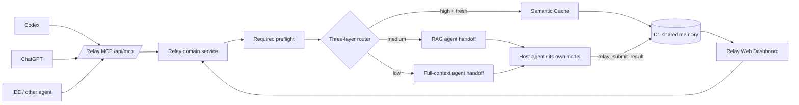
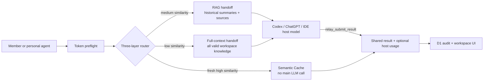

# Relay Production

Relay is a shared AI workspace and MCP gateway for teams and their personal agents. This directory is the production-oriented edition; the original seeded web demo remains unchanged in `../team-memory`.

The production edition deliberately has no demo seeds, fabricated model answers, anonymous hosted fallback, or shared demo database. It requires migrated D1 storage and authenticated requests. For MCP clients, Relay is now a routing and shared-memory layer rather than an LLM proxy: Semantic Cache returns a stored answer, while RAG and Full Generation return an agent handoff so Codex, ChatGPT, or an IDE agent performs the generation with its own host model.

## Product architecture



The Web API and MCP server share routing and freshness rules in `app/api/_lib/relay-service.ts`. MCP makes `relay_preflight` mandatory before `relay_execute`; RAG and Full Generation then require `relay_submit_result` after the host agent completes the work. The preflight is identity-bound, prompt-bound, expiring and single-use.

## MCP server

The stateless Streamable HTTP-compatible endpoint is `https://<relay-host>/api/mcp`. It exposes:

- `relay_preflight` — semantic retrieval, TTL/version validation, route decision and input-token estimate.
- `relay_execute` — returns a Semantic Cache answer or an `agent_action_required` handoff containing fresh context and host-agent instructions.
- `relay_submit_result` — stores the answer produced by the MCP host's model in shared memory and shared chat.
- `relay_search_memory` — read-only shared memory search.
- `relay_refresh_preflight` and `relay_refresh` — refresh a sourced record while preserving the old version.
- `relay_post_update` — return agent progress or results to the shared chat without an LLM call.
- `relay_get_workspace` — read route, savings, memory and MCP activity state.

Resources are available at `relay://workspace/<workspace-id>/{summary,memory,activity,savings}`. Configure a per-member bearer token in `RELAY_MCP_ACCESS_TOKENS`; the value is a JSON object mapping secret tokens to member names. MCP calls are recorded in `mcp_events`, and the Dashboard shows connected identities and audited calls.

## Token lifecycle

Every agent action is a two-step transaction:

1. Preflight selects the defense route. Exact fingerprints are checked first. Semantic retrieval then uses cached D1 document vectors plus one query embedding; without an embedding credential (or during a provider outage) Relay falls back to lexical retrieval. Semantic Cache reports zero main-model input.
2. The UI displays exact planned input tokens, the configured output ceiling, and the estimate expiry. Submission must include the short-lived estimate ID.
3. The server validates actor, prompt fingerprint, route, operation, matched record, TTL, and single-use state, then atomically claims the handoff.
4. Semantic Cache finishes immediately. RAG/Full Generation returns context to the host agent, which generates with its own model and calls `relay_submit_result` to persist the answer and optional host-reported usage.

An output token count cannot be known before generation, so the preflight shows `max_output_tokens`, not a fabricated prediction.



## Production safeguards

- Sites authentication is required in hosted environments. Local anonymous access is opt-in only.
- Token estimates expire, are bound to the member and exact request, and are atomically single-use.
- Stale, transactional, refresh-required, expired, or superseded records cannot be returned by Semantic Cache.
- Refresh creates a new record version and preserves the old record as superseded.
- MCP RAG and Full Generation never call a generation model from Relay or require a Workspace Master generation key.
- Host-agent results are not trusted as fresh until they are submitted through the bound handoff lifecycle.
- Uploads have a 10 MB limit, an allow-listed MIME type, sanitized R2 keys, and metadata stored in D1.
- D1 schema creation is migration-only. Request handlers do not silently create tables or insert seeds.

## Local setup

Requirements: Node.js 22.13+, pnpm, and the Sites/vinext runtime dependencies.

```bash
cp .env.example .env.local
pnpm install
pnpm db:generate
pnpm lint
pnpm typecheck
pnpm test
```

Apply every SQL file in `drizzle/` to the production D1 database before serving traffic. Set `RELAY_ALLOW_LOCAL_ANONYMOUS=true` only for local development. `GEMINI_API_KEY` enables free-tier multilingual semantic retrieval. `OPENAI_API_KEY` remains optional for exact OpenAI input counting and can also be used as the embedding fallback; the host agent still performs RAG/Full generation.

## Environment variables

| Variable | Required | Purpose |
| --- | --- | --- |
| `GEMINI_API_KEY` | recommended | Enables `gemini-embedding-001` semantic retrieval; it is never used for answer generation |
| `RELAY_EMBEDDING_PROVIDER` | no | `auto` (default) prefers Gemini, then OpenAI, then lexical; also accepts `gemini`, `openai`, or `lexical` |
| `OPENAI_API_KEY` | optional | Enables exact OpenAI input counting and provides an embedding fallback; MCP generation remains in the host agent |
| `RELAY_APP_MODE` | yes | Set to `production` |
| `RELAY_WORKSPACE_ID` | yes | Stable D1 partition and prompt-cache namespace |
| `RELAY_SEMANTIC_CACHE_THRESHOLD` | no | High-similarity direct reuse threshold; default `0.78` |
| `RELAY_RAG_THRESHOLD` | no | Medium-similarity RAG threshold; default `0.42` |
| `RELAY_DEFAULT_TTL_HOURS` | no | Default TTL for dynamic knowledge; default `24` |
| `RELAY_TOKEN_ESTIMATE_TTL_SECONDS` | no | Preflight validity window; minimum 60, default `300` |
| `RELAY_MAX_OUTPUT_TOKENS` | no | Generation output ceiling; default `1200` |
| `RELAY_MAX_INPUT_TOKENS` | no | Workspace input safety limit; default `100000` |
| `RELAY_ALLOW_LOCAL_ANONYMOUS` | local only | Explicitly permits a local anonymous actor |
| `RELAY_MCP_ACCESS_TOKENS` | for MCP | Secret JSON map of bearer tokens to workspace member names |

Bindings are declared in `.openai/hosting.json`: D1 as `DB` and R2 as `FILES`. Hosted access is private by default through Sites authentication.

Embedding vectors for Workspace answers are generated once and cached in D1 by model and dimension. A query creates only one new embedding; exact duplicate questions bypass the embedding provider entirely. Provider failures degrade to lexical matching so MCP agents remain usable. Gemini uses the retrieval-specific query/document task types and 768 dimensions; OpenAI keeps the existing 256-dimensional `text-embedding-3-small` path.

## Verification

`pnpm test` performs a production build and source-level contract tests for authentication, MCP tools/resources, agent handoff/submission, shared routing, estimate binding/claiming, stale-cache blocking, migration coverage, and the production UI. Live provider calls are intentionally not made in CI.

See [DEVELOPMENT.md](./DEVELOPMENT.md) for the file-to-flow handoff guide and [DEMO_GUIDE.md](./DEMO_GUIDE.md) for the complete Chinese demo runbook, prompts, MCP examples and troubleshooting checklist.

## Official implementation references

- [OpenAI input token counting](https://platform.openai.com/docs/api-reference/responses/input-tokens)
- [OpenAI prompt caching](https://platform.openai.com/docs/guides/prompt-caching)
- [OpenAI Apps SDK MCP server quickstart](https://developers.openai.com/apps-sdk/quickstart#mcp-server-with-apps-sdk-resources)
- [Prompt Cache: Modular Attention Reuse for Low-Latency Inference](https://proceedings.mlsys.org/paper_files/paper/2024/file/a66caa1703fe34705a4368c3014c1966-Paper-Conference.pdf)
